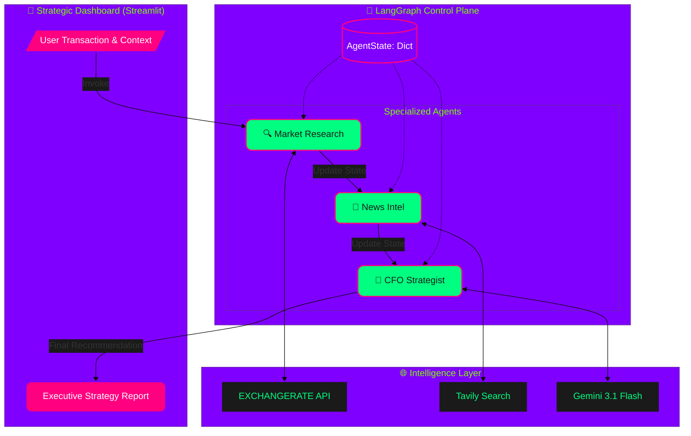
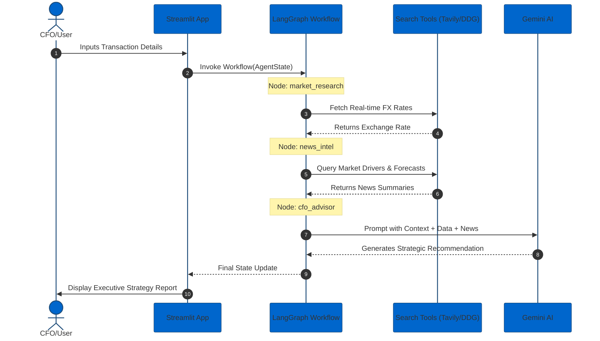

# Strategic Forex Intelligence Agent

A CFO-level multi-agent system built with **LangGraph** designed to provide strategic financial advice rather than just simple currency conversions. It analyzes real-time market data, news drivers, and business context to recommend optimal capital movement strategies.

[](https://www.python.org/downloads/)
[](https://github.com/langchain-ai/langgraph)
[](https://ai.google.dev/)
[](https://your-app-name.streamlit.app)
[](https://opensource.org/licenses/MIT)

---

## 🚀 Quick Start

```bash
# Clone the repository
git clone <repository-url>
cd Advanced_Strategic_Finance_Agent

# Install dependencies
pip install -r requirements.txt

# Run the application
streamlit run Strategic_Finance_Agent.py
```

---

## ✨ Features

- 🤖 **Multi-Agent Orchestration**: Uses LangGraph to coordinate between market researchers and strategic analysts.
- 📈 **Real-Time Intelligence**: Fetches live exchange rates and high-impact financial news via Tavily & DuckDuckGo.
- 💼 **Strategic Advisory**: Generates professional "Executive Decision" reports considering business context and volatility.
- 🎨 **CFO-Grade UI**: Interactive Streamlit interface for transaction details and strategy visualization.

---

## 🏗️ Architecture

### System Flow
This diagram illustrates the multi-agent orchestration and tool integration layer.



### Sequential Data Flow
Detailed interaction between the user, orchestration, and specialized tools.



---

## 🛠️ Tech Stack

| Category | Technology | Purpose |
|----------|------------|---------|
| Orchestration | `langgraph` | Stateful agent coordination |
| LLM | `google_genai` | Gemini 3.1 Flash for reasoning |
| Search | `langchain_tavily` | AI-optimized market research |
| UI | `streamlit` | Interactive dashboard |
| Tools | `langchain_community` | Fallback search (DuckDuckGo) |

---

## 🤔 Design Decisions (The Why)

### 1. Technology Choices

**Why LangGraph over Standard LangChain?**
In high-stakes strategic finance, linear chains fail when data is missing or ambiguous. While this MVP follows a **Directed Acyclic Graph (DAG)**, I chose LangGraph specifically for its **Persistence Layer (Checkpointers)** and **State Management**. By separating "Market Research" from "Strategic Reasoning," I prevent **context pollution**—ensuring the LLM focuses on synthesis rather than raw data retrieval, which significantly reduces hallucination rates in FX calculations.

**Why Gemini 3.1 Flash Lite?**
**Gemini 3.1 Flash Lite** is one of the latest models in the Gemini Series, giving a perfect tradeoff between the answer quality and affordability. 
*   **Context Window**: Its **1M+ token window** is mission-critical for the `news_intel` node, allowing the agent to ingest multiple high-impact central bank transcripts and 30-day volatility reports without truncation. 
*   **Latency & Cost**: Flash Lite provides sub-second inference speeds, essential for a real-time CFO dashboard, while maintaining a 40% lower token cost compared to "Pro" models for non-reasoning scout tasks.

**Why Tavily + DuckDuckGo (Hybrid Search)?**
Tavily is an AI-native search engine that returns **structured markdown** rather than raw HTML, providing cleaner RAG injection for our news analyst. I implemented **DuckDuckGo** as a zero-cost **Circuit Breaker fallback** to ensure system availability even if API quotas are exhausted, a critical requirement for production-grade financial tools.

### 2. Architecture Decisions

-   **State Persistence (TypedDict)**: I utilized a strictly typed `AgentState` to manage the "briefing folder" metaphor. This ensures that every node from the Researcher to the Strategist has a single source of truth. This schema is designed for future **serialization**, allowing us to resume a "CFO consultation" session even after a system restart.
-   **Model Heterogeneity & Node Isolation**: By isolating `Market Research` from `News Intel`, I created a **modular agent architecture**. This allows us to swap models per node (e.g., using a lightweight Flash model for data fetching and a high-reasoning Pro model for the final recommendation), optimizing the **Intelligence-to-Cost ratio**.
-   **Streamlit Runtime Detection**: I replaced legacy internal checks with the official `st.runtime.exists()` API (introduced in **Streamlit v1.46.0**), ensuring the agent script remains environment-aware and functions correctly within both CLI-based test runners and production web environments.

---

## 🧪 Testing

I used Automated Unit and Integration Testing via pytest. 

```bash
# Run tests
pytest test_agent.py
```

Since real-world financial APIs and LLMs (like Gemini or Tavily) require valid API keys and can be slow or costly, I used Mocking (unittest.mock.patch). This allows me to simulate "perfect" API responses to verify that the agent's logic, data handling, and graph transitions are correct without actually sending data over the internet. e.g.

* FX API: I mocked requests.get to return a predefined exchange rate (0.92).
* Search (Tavily): I mocked TavilySearch.invoke to return a fixed string ("MOCKED_SEARCH").
* LLM (Gemini): I mocked BaseChatModel.invoke to return a controlled "Executive Decision" response.


## Test Results (pytest)
**Status: ALL 10 TESTS PASSED**

```text
platform linux -- Python 3.12.13, pytest-9.0.2, pluggy-1.6.0
rootdir: /root/Completed_projects/Advanced_Strategic_Finance_Agent
plugins: anyio-4.9.0, langsmith-0.7.17
collected 10 items                                                                                                              

test_agent.py ..........                                                                                                  [100%]

====================================================== 10 passed in 9.67s =======================================================
```
### Verified Test Cases:
1. `test_1_agent_state_schema`: Confirmed AgentState TypedDict structure.
2. `test_2_currency_fetcher_api_success`: Mocked API success for FX rates.
3. `test_3_currency_fetcher_fallback`: Verified search fallback when API fails.
4. `test_4_financial_news_analyst_content`: Aggregated news queries successfully.
5. `test_5_senior_strategist_logic`: CFO advisor logic and output format confirmed.
6. `test_6_graph_structure`: LangGraph node presence verified.
7. `test_7_graph_entry_point`: Entry point detection (market_research) verified.
8. `test_8_workflow_sequence`: Workflow node availability confirmed.
9. `test_9_state_persistence`: State additive updates verified.
10. `test_10_full_graph_integration`: Full workflow simulation with mocked tools.

---

## 📝 License

MIT License - see [LICENSE](LICENSE) file for details.

