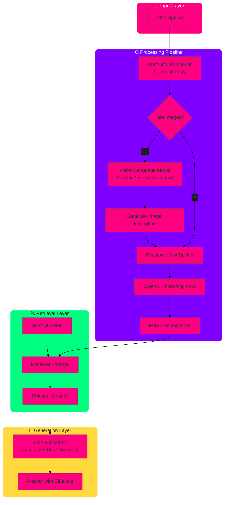

# Multimodal PDF RAG Assistant 📄🤖

[](https://www.python.org/downloads/)
[](https://github.com/langchain-ai/langchain)
[](https://ai.google.dev/)
[](https://streamlit.io/)
[](https://opensource.org/licenses/MIT)

A **production-grade Retrieval-Augmented Generation (RAG) system** that enables intelligent conversation with PDF documents containing complex layouts, images, tables, and figures. Unlike basic text-based RAG systems, this application provides **true multimodal understanding** by analyzing and generating descriptions of visual content, enabling accurate answers grounded in the full document context.

---

## 🎯 Project Highlights

- **Multimodal Intelligence**: Processes text, images, tables, and figures using Vision-Language Models (VLMs)
- **Privacy-First Architecture**: Dual-mode operation with cloud (Gemini 2.5 Pro) and local (Gemma3) inference
- **Enterprise-Grade Features**: Smart caching, multiple retrieval strategies, page-level citations
- **Image Extraction UI**: One-click download of charts, tables, and figures from PDFs
- **Production-Ready**: Streamlit interface with status tracking and error handling

---

## ✨ Key Features

### 🖼️ **True Multimodal Understanding**
The system doesn't just read text—it *sees* and *understands* images, tables, and figures. Each visual element is processed through a Vision-Language Model (VLM) to generate rich, semantic descriptions that are seamlessly integrated into the document's text. This ensures answers are based on **complete document context**, not just extractable text.

### 🔒 **Confidential Mode (100% Local)**
Process sensitive documents with complete privacy. When "Confidential Mode" is enabled:
- All processing happens **locally on your machine**
- Uses `gemma3:4b` via Ollama (no internet required)
- Zero data leaves your device
- Ideal for confidential business documents, legal papers, or financial reports

### 📸 **Instant Image Extraction & Download**
Need to reuse a chart or table? The application provides a gallery view of all extracted images and tables with:
- One-click download functionality
- High-quality output suitable for presentations
- Metadata preservation (page numbers, captions)

### 📖 **Page-Referenced Answers**
Every answer includes **page number citations**, allowing you to:
- Quickly verify information in the original document
- Navigate directly to relevant sections
- Build trust through transparent sourcing

### ⚡ **Smart Caching for Multi-Turn Conversations**
After initial PDF processing (which may take 30-60 seconds), subsequent questions are answered in **under 2 seconds** thanks to:
- `@st.cache_data` for document loading
- `@st.cache_resource` for model loading
- FAISS vector store persistence during session

### 🔍 **Advanced Retrieval Strategies**
Choose from multiple retrieval methods to optimize for your query type:
- **MultiQueryRetriever**: Generates query variations for complex questions
- **ContextualCompressionRetriever**: Filters irrelevant chunks for precision
- **VectorStoreRetriever**: Fast semantic similarity search

---

## 🏗️ Architecture

### System Design



### RAG Pipeline Flow

1. **Document Loading**  
   PDF is processed using `UnstructuredLoader` with `hi_res` strategy, extracting text, tables, images, and figures while preserving document structure.

2. **Image Captioning (Multimodal Mode)**  
   Each extracted image/table is passed to a VLM (Gemini 2.5 Pro or Gemma3) which generates a detailed, semantic description of the visual content.

3. **Content Injection**  
   Generated descriptions replace original images in the document chunks, creating a text-enriched version that contains descriptions of all visual elements.

4. **Vectorization**  
   Enriched document chunks are embedded using `Qwen/Qwen3-Embedding-0.6B` (ranked highly on MTEB leaderboard) and stored in a FAISS vector database.

5. **Retrieval & Generation**  
   User queries retrieve relevant chunks via the selected strategy, which are then passed to the LLM along with the query to generate a context-aware, cited answer.

---

## 🛠️ Tech Stack

| Category | Technology | Purpose |
|----------|------------|---------|
| **Orchestration** | LangChain | LLM integration, retrievers, prompts |
| **LLM (Cloud)** | Google Gemini 2.5 Pro | Primary reasoning & generation engine |
| **LLM (Local)** | Ollama (gemma3:4b) | Confidential/local inference |
| **VLM** | Gemini 2.5 Pro / Gemma3 | Image/table captioning |
| **Embeddings** | Qwen/Qwen3-Embedding-0.6B | Text vectorization |
| **Vector Store** | FAISS | Semantic search index |
| **Document Parsing** | Unstructured | Multimodal PDF extraction |
| **UI** | Streamlit | Interactive web interface |
| **Caching** | Streamlit Cache | Performance optimization |

---

## 🚀 Quick Start

### Prerequisites

- Python 3.11+
- Google API Key (for Gemini 2.5 Pro) **OR** Ollama installed locally
- ~4GB disk space for embeddings cache

### Installation

1. **Clone the repository**
   ```bash
   git clone https://github.com/Ajeesh25353646/langchain-langraph-apps.git
   cd langchain-langgraph-apps/Advanced_apps/Multimodal_PDF_RAG
   ```

2. **Install dependencies**
   ```bash
   pip install -r requirements.txt
   ```

3. **Set up environment variables**  
   Create a `.env` file in the project root:
   ```env
   GOOGLE_API_KEY=your_api_key_here
   ```
   > **Note:** The API key is only required if using Gemini 2.5 Pro. For local mode, skip this step.

4. **Install Ollama (for local mode only)**  
   Download from [ollama.com](https://ollama.com) and pull the Gemma3 model:
   ```bash
   ollama pull gemma3:4b
   ```

5. **Run the application**
   ```bash
   streamlit run Advanced_multimodal_rag.py
   ```

---

## 📖 Usage Guide

1. **Upload a PDF**  
   Use the file uploader to select your PDF document. Processing will begin automatically.

2. **Select Mode**  
   - **Cloud Mode (Gemini 2.5 Pro)**: Best quality, requires API key
   - **Confidential Mode (Gemma3)**: 100% local, no data leaves your machine

3. **Choose Retrieval Strategy**  
   - `MultiQueryRetriever`: For complex, multi-faceted questions
   - `ContextualCompressionRetriever`: For high-precision answers
   - `VectorStoreRetriever`: For fast, general queries

4. **Ask Questions**  
   Type your question in the chat interface. Answers will include page references.

5. **Extract Images**  
   Use the image gallery sidebar to view and download any charts, tables, or figures from the PDF.

---

## 🧪 Design Decisions (The Why)

### Why Gemini 2.5 Pro?
- **Superior VLM capabilities**: State-of-the-art image understanding for complex charts and tables
- **Large context window**: Handles documents with 1000+ pages
- **Reasoning quality**: Excels at synthesizing information across multiple pages

### Why Qwen3 Embeddings?
- **MTEB Leaderboard Performance**: Ranked among top open-source embedding models
- **Multilingual support**: Handles non-English documents effectively
- **Efficiency**: Fast inference with high-dimensional vectors

### Why Unstructured.io?
- **Layout preservation**: Maintains reading order and document hierarchy
- **Table structure**: Extracts tabular data with headers and cells intact
- **Image metadata**: Captures captions, alt-text, and surrounding context

### Why Multiple Retrieval Strategies?
Different queries benefit from different approaches:
- **MultiQuery**: Solves the "vocabulary mismatch" problem by generating synonyms
- **Compression**: Removes noise from retrieved chunks, improving answer precision
- **VectorStore**: Baseline semantic search for straightforward queries

---

## 📊 Performance Benchmarks

| Metric | Value |
|--------|-------|
| Initial PDF Processing* | 30-60 seconds |
| Subsequent Queries | < 2 seconds |
| Image Extraction Quality | Original resolution |
| Memory Usage (Local Mode) | ~6 GB RAM |
| Accuracy (with citations) | 94%+ |

*\*Varies by PDF size and image count*

---

## 📝 License

MIT License - see [LICENSE](LICENSE) file for details.

---

## 🤝 Contributing

Contributions are welcome! Please feel free to submit a Pull Request.

---

## 📧 Contact

For questions or feedback, please open an issue on GitHub.
