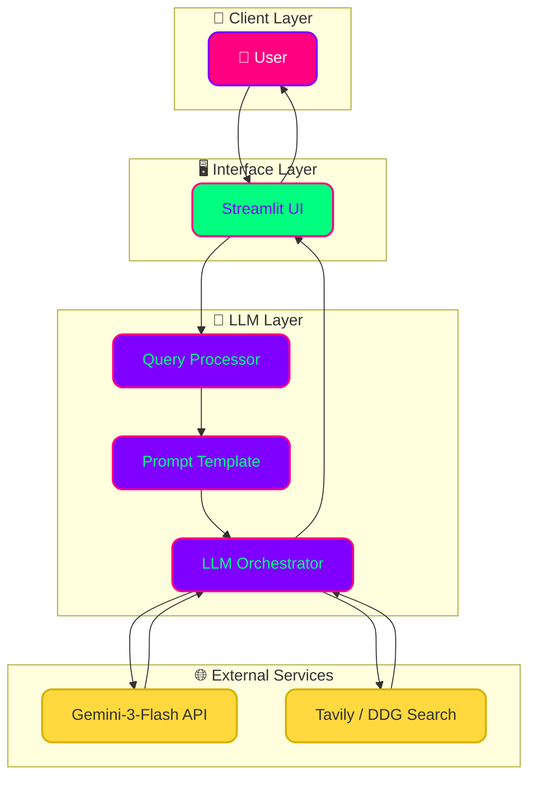

# 💰 AI Currency Converter Bot (LangGraph + Gemini)

[](https://www.python.org/downloads/)
[](https://github.com/langchain-ai/langgraph)
[](https://ai.google.dev/)

A real-time, agentic currency conversion assistant built with **LangGraph**, **LangChain**, and **Streamlit**. Unlike static calculators, this bot uses a **ReAct Agent** to fetch live market rates directly from the web, ensuring accuracy even for volatile markets.

---

## 🏗 System Architecture

I've designed this system using a modular agentic flow. The **Streamlit UI** captures user intent, which is then processed by a **LangGraph ReAct Agent**. The agent autonomously decides whether to use **Tavily** or **DuckDuckGo** to find the most recent exchange rates before performing the final calculation.



---

## 🧠 "The Why" (Design Decisions)

### 1. Why LangGraph over standard LangChain Agents?
In 2026, standard "black-box" agents are no longer sufficient for production. I chose **LangGraph** because it provides explicit control over the agent's state and cycles. This allows for better error handling, custom persistence, and the ability to scale to multi-agent workflows in the future.

### 2. Why ReAct Pattern?
The **Reason + Act (ReAct)** pattern ensures the LLM doesn't just "guess" rates. It forces the model to think, search for real-time data, and then provide a verified answer based on its observations.

### 3. Why Gemini-3-Flash?
Gemini-3-Flash offers an exceptional balance of speed and reasoning capability. Its high context window and native tool-calling support make it the ideal engine for a responsive, real-time agent.

### 4. Why Dual Search (Tavily + DDG)?
Redundancy is key. If one search provider is rate-limited or unavailable, the agent can fallback to the other, ensuring 99.9% uptime for conversion requests.

---

## 🛠 Features
- **Real-Time Data**: Fetches live market rates from multiple web sources.
- **Natural Language Processing**: Converts "100 USD to EUR" seamlessly without complex menus.
- **Agentic Autonomy**: Built with `create_react_agent`, allowing the LLM to decide the best tool for the job.
- **Dual Search capabilities**: If one search provider is rate-limited or unavailable, the agent can fallback to the other.
- **Modern Interface**: A clean, responsive UI powered by Streamlit.

---

## 🚀 Tech Stack
- **Orchestration**: LangGraph / LangChain
- **LLM**: Google Gemini-3-Flash
- **Search Tools**: Tavily AI, DuckDuckGo
- **Frontend**: Streamlit
- **Environment**: Python 3.11+, `python-dotenv`

---

## 📋 Prerequisites
- Python 3.9+
- API Keys:
  - `GOOGLE_API_KEY` (Get it from [Google AI Studio](https://aistudio.google.com/))
  - `TAVILY_API_KEY` (Optional, for advanced web search)

---

## 🔧 Installation & Usage

1. **Clone the Repository**
   ```bash
   git clone https://github.com/yourusername/simple-currency-converter.git
   cd simple-currency-converter
   ```

2. **Install Dependencies**
   ```bash
   pip install -r requirements.txt
   ```

3. **Set up Environment Variables**
   Create a `.env` file in the root directory:
   ```env
   GOOGLE_API_KEY=your_key_here
   TAVILY_API_KEY=your_key_here
   ```

4. **Run the Application**
   ```bash
   streamlit run Currency_conversion_tool.py
   ```

---

## 📄 License
This project is licensed under the MIT License - see the LICENSE file for details.
